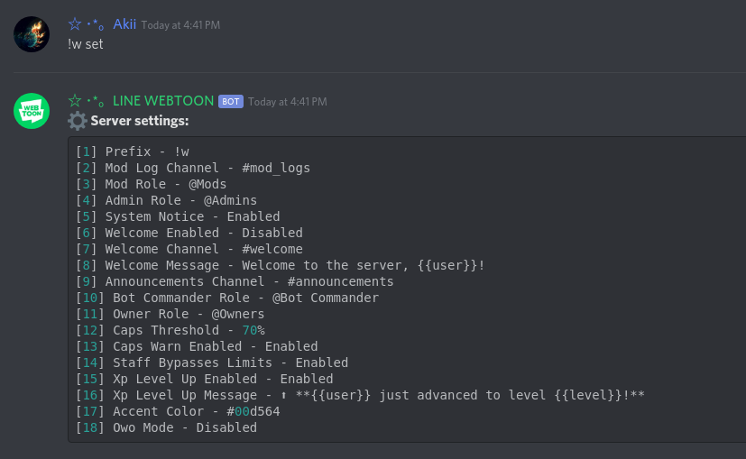
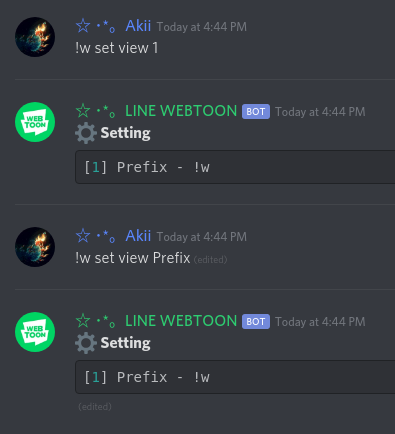
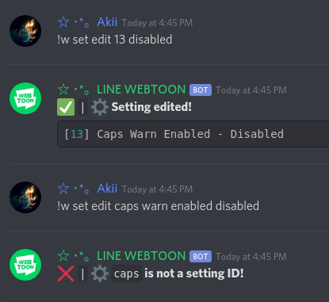

# !w set
Command: src/commands/Server/set.js

Each setting is mapped to an ID. This is necessary for the editing of a setting, due to the architecture of the bot.

* `!w set` - Displays all settings.
* `!w set view <setting name / ID>` - Displays current setting key/value pair, with its ID.
  * Example: `!w set view prefix` or `!w set view 1`
* `!w set edit <ID> <new value>` - Edits a setting **by setting ID** to a new value.
  * Example: `!w set edit 1 .w` - Changes the prefix (set to ID #1 to ".w")
* `!w set reset <setting name / ID>` - Resets a setting name / ID back to its original value
  * Example: `!w set reset 1` => `!w` (resets prefix back to "!w")

### Sample images:

